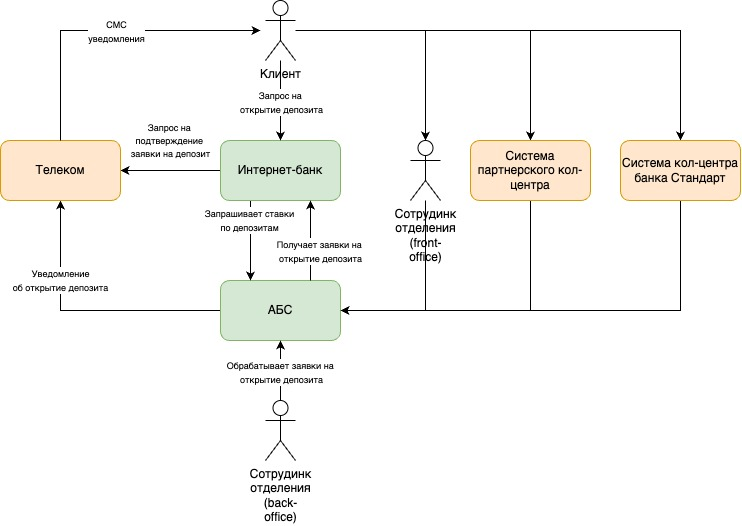
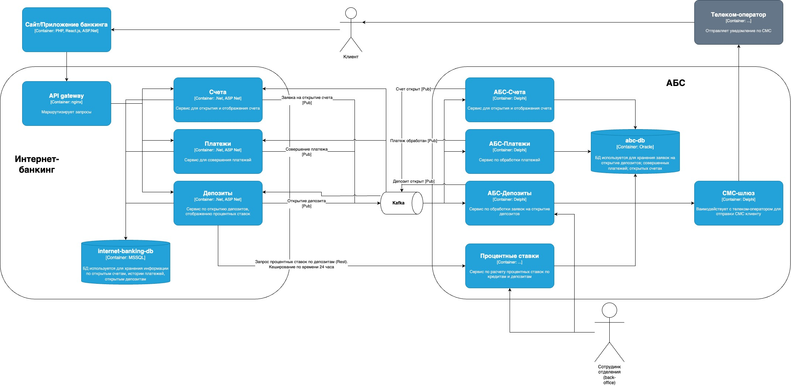

### **Название задачи:** Открытие депозитов онлайн
### **Автор:** - 
### **Дата:** 2025.05.25
### **Функциональные требования**
Опишите здесь верхнеуровневые Use Cases. Их нужно оформить в виде таблицы с пошаговым описанием:

|**№**|**Действующие лица или системы**|**Use Case**|**Описание**|
| :-: | :- | :- | :- |
|1|Клиент, Интернет-банкинг, АБС, Сотрудник бэк-офиса|1. Клиент заходит на сайт/приложение интернет банкинга с целью узнать информацию о ставках депозита. 2. Сервис Депозит (Интернет-банкинг) делает REST запрос в сервис процентные ставки (АБС). 3. Сервис процентные ставки обрабатывает excel-файл, который обновляют сотрудники бек офиса каждый день. 4. Обработанные из excel-файла ставки кешируются с временем жизни до 24 часов. 5. Ответ от Сервиса процентных ставок также кешируется в сервисе Депозит (интернет-банкинг) до 24 часов | F1, F3, F4, F7|
|2|Клиент, Интернет-банкинг, АБС, Сотрудник бэк-офиса|1. Клиент заходит на сайт/приложение интернет банкинга с целью открыть депозит - вводит сумму депозита. ФИО и другие атрибуты указанные при регистрации подтягиваются автоматически. Нажимает кнопку - открыть. Данные передаются по защищенному каналу с испоьзованием TLS/SSL (TLS версвии > 1.2) 2. Сервис Депозит добавляет запрос в kafka. 3. Сервис АБС-Депозит считывает запрос на открытие депозита и отправляет в СМС-телеком-шлюз запрос на подтверждение. 4. СМС-шлюз через Телеком-оператора отправляет СМС с подтверждением открытия. 5. Клиент подтверждает открытие - вводит код из СМС, что отправляется в сервис Депозит. 6. Сервис депозит добавляет подтверждение в kafka. 7. Сервис АБС-Депозит сравнивает СМС код подтверждения и в случае успеха добавляет заявку на открытие депозита в abc-bd. 7. Сотрудник бек-офиса обрабатывает эти заявки. 8. Отправляется СМС об открытии депозита.| F2, F5, F6, F8|
### **Нефункциональные требования**
Опишите здесь нефункциональные требования и архитектурно-значимые требования.

|**№**|**Требование**|
| :-: | :- |
|R1| Защита персональных данных при отправки заявки онлайн. Шифрование чувствительных данных при передаче и хранении.|
|R2-3| Доступность 99.9% и работа 24/7 |
|R4| До 1000 RPS |
|P1 | Отклик по всем операциям |
| P2  | Добавить возможность горизнтального масштабирования |
| P3  | Перейти от монолита к микросервисной архитектруре                               |
| S1  | Заявки на открытие депозита также обрабатывает бэк-офис                                |
|     | Использовать технологии, которые уже есть в банке и есть экспертиза - MS SQL, Oracle, ASP NET                                |
|     | Избежать работы интернет-банка с API АБС                                |
### **Решение**

Context diagram: 

Container diagramm: 

Для обеспечения безопасности передачи данных от клиента - используется безопасные каналы передачи данных с использованием TLS/SSL (TLS версии > 1.2). При хранении данных в БД персональные данные также шифруются. Для обеспечения высокой доступности и масштабирования - используется kafka. Также из-за текущей спицифики обработки запросов на открытие депозитов и ограничений на нагрузку на АБС - используются ассинхронные запросы. Для уменьшения нагрузки на АБС - ответ от АБС при получении ставок депозитов кешируется с помощью Cache-aside до 24 часов. Таким образом можно поддерживать высокий отклик системы. При выборе технологий сервисов опирался на существующий стек технологий. За счет наличия резервного ЦОДа можно поддерживать вертикальное масштабирование. Интернет-банкинг развернут на платформе поставщика и она поддерживает микросервисную архитектуру. В текущей архитектуре заявки также обрабатывает бэк-офис.
### **Альтернативы**
Альтернативы: 
- Использовать Active-MQ. 
- Не использовать MQ, а использовать MS SQL базу для хранения заявок.

**Недостатки, ограничения, риски**

- Использование Active-MQ удовлетворило требование по доступности, но в перспективе с ростом числа активных пользователей могли бы возникнуть проблемы с доступность и отказоустойчивостью.
- При использовании MS SQL, как базы хранения заявок при росте кол-во пользователей синхронные запросы не удовлетворяли бы скорости отклику и возросло бы время отказа системы, так как эта БД испытывала бы очень большую нагрузку, отказам и невыполнению требованиям доступности.
