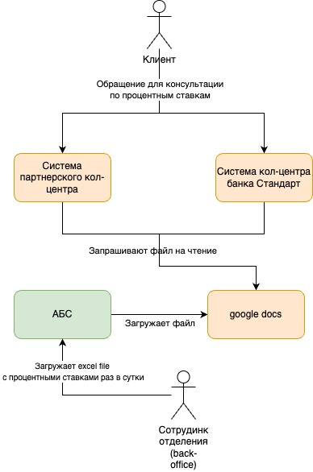
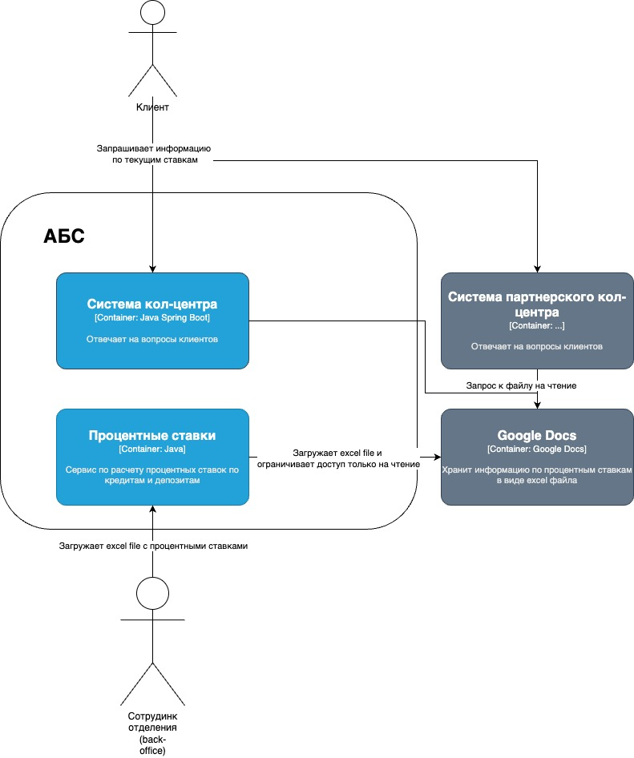

### **Название задачи:** Консультация по текущим ставкам через кол-центр.
### **Автор:** - 
### **Дата:** 2025.05.25
### **Функциональные требования**
Опишите здесь верхнеуровневые Use Cases. Их нужно оформить в виде таблицы с пошаговым описанием:

|**№**|**Действующие лица или системы**|**Use Case**|**Описание**|
| :-: | :- | :- | :- |
|3|Клиент, АБС, Система кол-центра, Система партнерского кол-центра, Сотрудник бэк-офиса|1. Клиент звонит в 1 из колл-центров - кол-центр банка или партнерский кол-центра. 2. Сотрудники кол-центра смотрят в excel-file в google docs по процентным ставкам с правами только на чтение. 3. Сотрудник бэк офиса раз в сутки вычисляет процентные ставки и загружает excel file в Сервис Процентные ставки. 4. Сервис Процентные ставки загружает файл с процентными ставками в google docs и устанавливает права доступа на чтение. | |
### **Нефункциональные требования**
Опишите здесь нефункциональные требования и архитектурно-значимые требования.

|**№**|**Требование**|
| :-: | :- |
|     | получение информации по актуальным ставкам сотрудниками кол-центра в виде файлов, а не через API                                |
### **Решение**

Context diagram: 

Container diagramm: 

В каждом кол-центре есть очередь звонков и в случае перегрузки кол-центра автоответчик говорит о размере очереди и предлагает обратиться в партнерский кол-центр. Так как информация по текущим актуальным ставкам - общедоступная информация, то эту информацию можно хранить в открытых источниках и пользоваться облачными бесплатными сервисами такими как google docs. Для того, чтобы сервис процентных ставок не выложил в открытый доступ какую-либо персональную информацию, что может присутствовать в файле, то этот сервис читает загружаемый excel file сотрудником бэк офиса и извлекает информацию из файла по заданному шаблону, а затем формирует excel file и загружает на google docs с правами только на чтение.
### **Альтернативы**
Альтернативы: 
- Отправлять файл по почте всем сотрудникам бэк офиса.
- Написать сервис, который будет загружать файл по FTP, или добавить получение инф-ции по API.

**Недостатки, ограничения, риски**

- Нужно будет поддерживать в актуальном состоянии список пользователей, кому отправлять файл.
- Данное решение по трудозатратам будет более дорогостоющее и сложно будет поддерживать в актуальном состоянии файл со ставками, если инициатор запроса на скачивание будет сотрудник кол-центра.
